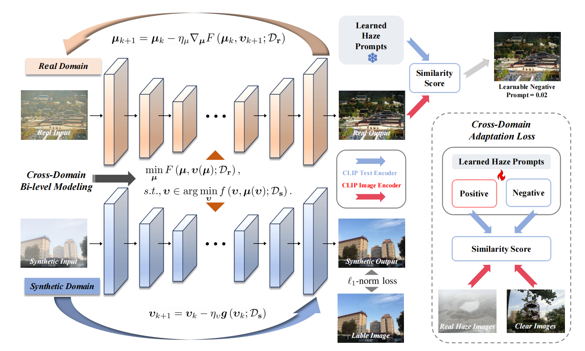
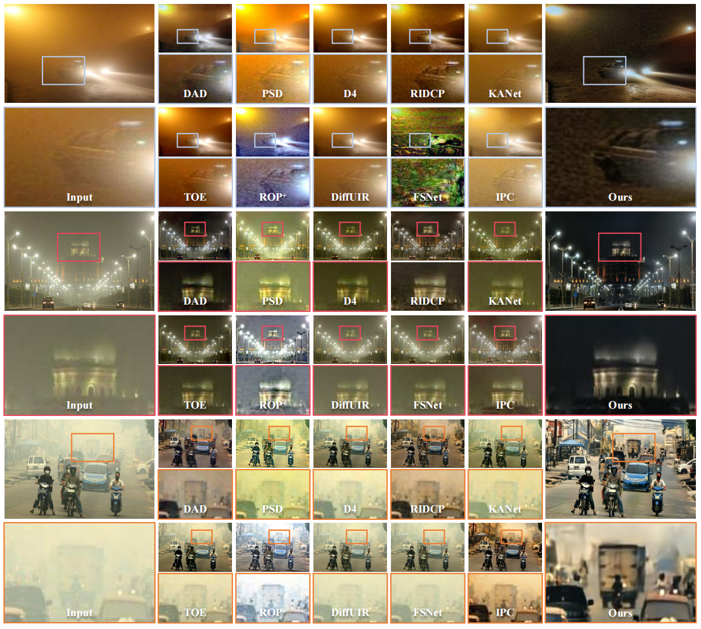

<div align="center">

<h1>BiDA: Bi-level Domain Adaptation for Real-world Image Dehazing</h1>

<div>
    Yan Zhang</a>&emsp;
    Yuxin Feng</a>&emsp;
    fan Zhou</a>&emsp;
    Zhuo Su</a>
</div>


<div>
    <h4 align="center">
        <a href="https://pan.baidu.com/s/1Xm9lRFTupWl-SWrGa6X9Gw?pwd=0519" target='_blank'>[Weight]</a>
    </h4>
</div>

</div>

## :mag: Method



## :pencil2: Results



## :desktop_computer: Environment

Step 1. Clone this repo:

```
git clone https://github.com/YanZhang-zy/CoA.git
cd CoA/
```

Step 2. Create a new conda environment and install dependencies:

```
conda create -n CoA python=3.10
conda activate CoA
conda install pytorch==2.2.0 torchvision==0.17.0 torchaudio==2.2.0 pytorch-cuda=11.8 -c pytorch -c nvidia
pip install -r requirements.txt
```

##  :book: Data Preparation

Step 1. Download the haze dataset from websites or papers.
Step 2. Make sure the file structure is consistent with the following:

```
dataset/
├── HAZE4K
│   ├── test
│   |   ├── clear
│   |   │   ├── 1.png
│   |   │   └── 2.png
│   |   │   └── ...
│   |   └── hazy
│   |       ├── 1_0.89_1.56.png
│   |       └── 2_0.93_1.66.png
│   |       └── ...
│   └── train
│       ├── clear
│       │   ├── 1.png
│       │   └── 2.png
│       │   └── ...
│       └── hazy
│           ├── 1_0.68_0.66.png
│           └── 2_0.59_1.95.png
│           └── ...
├── REAL_FOGGY
│   ├── 1.png
│   └── 2.png
│   └── 3.png
│   └── ...
```

The datasets can be downloaded at
+ [RESIDE](https://sites.google.com/view/reside-dehaze-datasets/reside-v0)
+ [HAZE4K](https://pan.baidu.com/s/19stkJ3aaF8WgHK2FBytnZA?pwd=0411)
+ [REAL_FOGGY](https://pan.baidu.com/s/1GS9qkwcBcKB411pdSwFcDg?pwd=0519)

## :train: Pre-trained Haze Prompt Pairs Training

In our experiment, we randomly select 4000 haze images from URHI training dataset and 2000 clear images from RESIDE-Outdoor testing dataset as the unpaired training data. We provide the training data we use at [[BaiduPan](https://pan.baidu.com/s/1G8yiq6CWRzVHEZKhu-SD7A?pwd=0314)] for your reference. For the specific training code, please refer to [CLIP-LIT](https://github.com/ZhexinLiang/CLIP-LIT.git).


## :hotsprings: Model Training
Step 1. Download the pre-trained Res2Net model weight from [[BaiduPan](https://pan.baidu.com/s/16WZ8FcMiY4JrkwxFy2yTLA?pwd=0214)].

Step 2. Make sure the file structure is consistent with the following:
```
model/
└── imagenet_model
    └── res2net101_v1b_26w_4s-0812c246.pth
clip_model/
├── haze_prompt.pth
├── RN101.pt
└── ViT-B-32.pt
```

Step 3. Run the following script to train CoA from scratch:
```
python Teacher.py
python KD.py
```

## :taxi: Model Testing
Step 1. Download the pre-trained model weights from [[BaiduPan](https://pan.baidu.com/s/16WZ8FcMiY4JrkwxFy2yTLA?pwd=0214)].

Step 2. Make sure the file structure is consistent with the following:
```
model/
├── Teacher_model
│   └── Teacher.pth
├── Student_model
│   └── Student.pth
├── EMA_model
│   ├── EMA.pth
│   └── EMA_r.pth
```

Step 3. Run the following script to test CoA:
```
python Eval.py
```

## :clipboard: Acknowledgments
We would like to extend our gratitude to the following implementations for their contributions to the development of CoA:

- [CLIP-LIT](https://github.com/ZhexinLiang/CLIP-LIT.git) for providing the methodology for training pre-trained prompt pairs.
- [DEA-Net](https://github.com/cecret3350/DEA-Net.git) for providing the re-parameterization technique.

## :triangular_flag_on_post: Citation
If you find our paper and repo are helpful for your research, please consider citing:

```bibtex
@inproceedings{ma2025coa,
 author={Long Ma, Yuxin Feng, Yan Zhang, Jinyuan Liu, Weimin Wang, Guangyong Chen, Chengpei Xu, Zhuo Su},
 booktitle={Proceedings of the IEEE/CVF Conference on Computer Vision and Pattern Recognition (CVPR)},
 title={CoA: Towards Real Image Dehazing via Compression-and-Adaptation},
 year={2025}
}
```

## :mailbox_with_mail: Contacts 
If you have any questions or suggestions about this repo, please feel free to contact me (zhangy2779@mail2.sysu.edu.cn).
